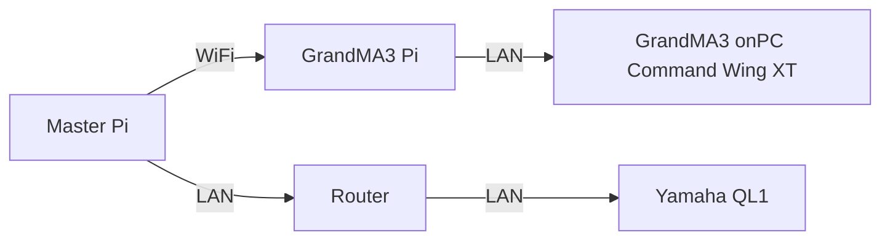

<h1 align="center">
  Backlog 1 Sprint 1
</h1>

<p align="center">
  <i align="center">Open Sound Control and GUI Making </i>⚙️
</p>


## Overview

>In this sprint of the first backlog, the tasks are:
>1. RasPi to QL1 communication
>2. RasPi to QL1 control
>3. RasPi to MA3 communication
>4. RasPi to MA3 control
>5. Design a user-friendly GUI 

## Table of Contents
> - [What is Needed](#what-is-needed)
> - [Related Links](#related-links)
> - [Hardware Setup](#hardware-setup)
>    - [System Diagram](#system-diagram)
> - [Install Open Source Control](#installing-open-source-controlosc-on-raspberry-pi)
> - [OSC Communication](#osc-communication-to-yamaha-ql1-and-grandma3)
>    - [Yamaha QL1](#yamaha-ql1)
>    - [GrandMA3](#grandma3)
> - [Start Up](#start-up)


## What is Needed?

>Inside the RasPi you would need the following files:
>- [MA3.py](./MA3.py)
>- [osc_client.py](./osc_client.py)
>- [QL1.py](./Yamaha%20QL1/QL1.py)

>Sample code can be found in the [Backlog 1 Sprint 1](../Backlog%201%20Sprint%201) folder.

## Related Links

> - [Tutorial 4 - Raspberry Pi to QL1](https://github.com/huats-club/oscstarterkit/tree/main/tutorial4)
> - [Tutorial 5 - Raspberry Pi to GrandMA3](https://github.com/huats-club/oscstarterkit/tree/main/tutorial5)


## Hardware Setup
### System Diagram


## Installing Open Source Control(OSC) on Raspberry Pi

> 1. Install Python-OSC on Raspberry Pi:
 ```sh
 pip install python-osc
 ```

 ## OSC Communication to Yamaha QL1 and GrandMA3
 ### Yamaha QL1

>To change the values of the Yamaha QL1 Faders
```sh
def volume_down2():
    command = 'set MIXER:Current/InCh/Fader/Level 1 0 {newvalue1}' #change this last value accordingly
    run_command(command)
    time.sleep(1)
```
> [command_list.pdf](./Yamaha%20QL1/command_list.pdf) has all the functions that can control different functions of the QL1

> Change the IP Address of the Yamaha QL1 accordinglyy
```sh
def send_osc():
    # Define OSC message parameters and send OSC message
    PI_A_ADDR = "192.168.1.128"  # IP address of the receiving Raspberry Pi
    PORT = 49820  # Port of the receiving Raspberry Pi
```


### GrandMA3
> Change the IP Address to the IP Address of the device the GrandMA3 is running on
```sh 
LAPTOP_IP = "192.168.1.103"		# send to laptop with grandMA3
PORT = 8000                     # laptop with grandMA3 port number
addr = "/gma3/cmd"
```

> If you wish to change the commands for the buttons:
```sh
def MA3_Fader1Up():
    if __name__ == "__main__":
        send_message(LAPTOP_IP, PORT, addr, "FaderMaster Page 1.201 At 100") # function to send to grandMA3
        # change by using grandMA3
```
### Start Up
> When running each [MA3.py](./MA3.py) and [QL1.py](./Yamaha%20QL1/QL1.py) file, each has their own designated GUI 

### To Start
>1. Enter Virtual Environment
```sh
source <environment_folder>/bin/activate
```
>2. Run the file
```sh
python3 QL1.py

```
```sh
python3 MA3.py 
```
