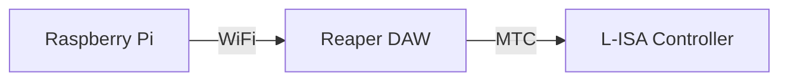

<h1 align="center">
  Backlog 2 Sprint 1
</h1>

  <i align="center">Reaper DAW & L-ISA Controller </i>🎧

## Overview
In this sprint of the second backlog, the tasks are to:
1. Raspberry Pi to Reaper DAW OSC Communication
2. Reaper DAW to L-ISA Controller via MIDI Timecode (MTC)
3. Create audio assest for station activity
4. Object-based mixing on L-ISA Controller

Sample codes can be found in the 'Backlog 2 Sprint1' Folder

* [add file here](./Gui.py) - A GUI containing controls for Reaper DAW. (E.g. Jumping to markers, play/stop)
* [add file here](./markers.py) - A file containing code to enable OSC command for jumping to markers in Reaper DAW from the Raspberry Pi.
* [add file here](./play_stop.py) - A file containing code to enable OSC command for playing or stopping the track playback in Reaper DAW from the Raspberry Pi.
*[add foler with audio track here]
*[add pic of LISA soundscape here]

## Hardware
