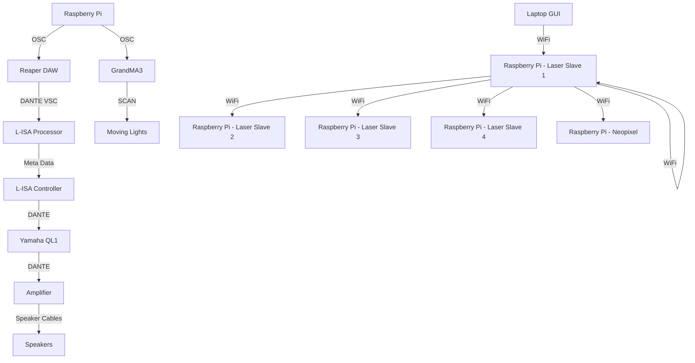

## 
Minimum Viable Product

All the resources required to demostrate a Minimum Viable Product, which basically means a full working demostration of the staion, Art of Hearing

## Overview
> This repository contains all the assests,codes and others for our Station 3 - Art Of Hearing.

>In this Proof Of Concept, there will be a master station which will be shared among all teams, which in the venue, there are 12 speakers in the venue.

>In this station, there will be 3 participants standing at each side of the room, each participants have to listen to the beat that correspond to their side of the room, to get a number and then come together to crack open the combination of the lock.

## Table Of Contents

## References
For the hardware and software connections, please consult the following: 

1. [Backlog 1 Sprint 1](../Backlog%201%20Sprint%201/) - Sending OSC Messages to GrandMA3

2. [Backlog 2 Sprint 1](../Backlog%202%20Sprint%201/) - Reaper and L-ISA Control Using OSC Commands

3. [Backlog 2 Sprint 2](../Backlog%202%20Sprint%201/) - Game

## Hardware and Software Setup

### Hardware Setup
> For the hardware setup, there are no changes made, hence refer to [POC](../POC/README.md) for the set up of hardware.

### System Diagram

## Media Assests
> Included in the MVP Demostration are: 
>
>[Legend Board](./Media%20Assests/legendboard.jpg)- Poster with the number Comibinations for the participants to refer to

>[Master File](./Master%20Files/) - Contains all the software used for the MVP, which includes:
> 1. [GrandMA3](./Master%20Files/MasterShowfile_EGL314_MVP_FINAL.show) Master file
> 2. [REAPER](./Master%20Files/314MAINREAPER_POC_FINAL.rpp) Master file
> 3. [L-ISA](./Master%20Files/MAINFILE%20POC_FINAL%20-%20copy.lisa) Master file

## Explanation
> Classified into 2 different folders, for easier differentiation and explantion: 
>1. Code
>2. Laser

### Code
