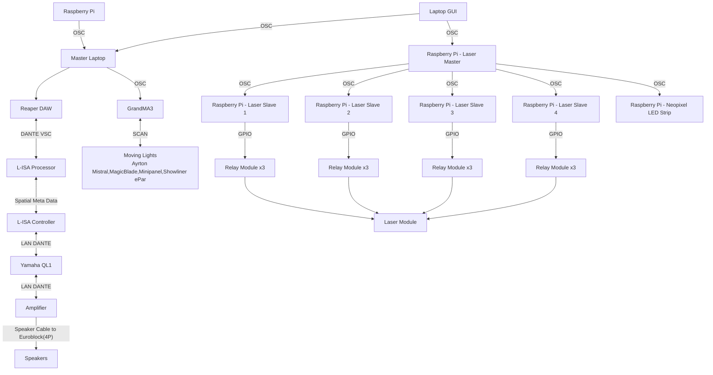

## <p align=center>Minimum Viable Product
</p>

<p align=center>All the resources required to demostrate a Minimum Viable Product, which basically means a full working demostration of the staion, Art of Hearing</p>

## Overview
> This repository contains all the assests,codes and others for our Station 3 - Art Of Hearing.

>In this Proof Of Concept, there will be a master station which will be shared among all teams, which in the venue, there are 12 speakers in the venue.

>In this station, there will be 3 participants standing at each side of the room, each participants have to listen to the beat that correspond to their side of the room, to get a number and then come together to crack open the combination of the lock.

## Table Of Contents


## References
For the hardware and software connections, please consult the following: 

1. [Backlog 1 Sprint 1](../Backlog%201%20Sprint%201/) - Sending OSC Messages to GrandMA3


2. [Backlog 2 Sprint 1](../Backlog%202%20Sprint%201/) - Reaper and L-ISA Control Using OSC Commands

3. [Backlog 2 Sprint 2](../Backlog%202%20Sprint%201/) - Game

## Hardware and Software Setup

### Hardware Setup
> For the hardware setup, there are no changes made, hence refer to [POC](../POC/README.md) for the set up of hardware.

### System Diagram

>In this system diagram, for any equipments used in the sending of OSC commands <b>MUST</b> be on the same network,including all the IP Addresses of the Raspberry PI.

### Software SetUp
><b>L-ISA</b>
> 1. On the L-ISA OSC page, change the Raspberry PI to OSC-ADM format, as the OSC control commands are more precise, allowing specific degress for accurate placement on the speakers.


## Media Assests
> Included in the MVP Demostration are: 
>
>[Legend Board](./Media%20Assests/legendboard.jpg)- Poster with the number Comibinations for the participants to refer to


>[Master File](./Master%20Files/) - Contains all the software used for the MVP, which includes:
> 1. [GrandMA3](./Master%20Files/MasterShowfile_EGL314_MVP_FINAL.show) Master file
> 2. [REAPER](./Master%20Files/314MAINREAPER_POC_FINAL.rpp) Master file
> 3. [L-ISA](./Master%20Files/MAINFILE%20POC_FINAL%20-%20copy.lisa) Master file

## Explanation
> Classified into 2 different folders, for easier differentiation and explantion: 
>1. Code
>2. Laser

### Code
> In the [game.py](./Code/game.py), upon running the program, the start page GUI appears as below: 

>There are mainly 5 buttons for demo, which mainly: 
>1. <b>Start</b> - To start and begin the game
>2. <b>High</b> - Plays a Biwa sound, symbolising the 'H' shown on the Legend Board
>3. <b>Low</b> - Plays a drum, symbolising the 'L' shown on the Legend Board
>4. <b>Demo</b> - Plays a demo number combination, mainly '1','0','1' 
> Participants can play buttons 2-4 as many times as they need to familiarise themselves with the beats and the pace of the demo. When they are ready to begin the game, pressing the 'Start' button starts a timer for 10s which afterwards starts the game.

#### Begin of Game

> When the game begins, this GUI is shown instead: 

>The functions here include 
> 1. <b>Number Combinations</b> - Pressing the '+'or '-' button will increase or decrease the current number shown respectively, able to loop to '9' when pressing '-' when the number is 0.
> 2. <b>Check Combination</b> - When participants has input a number combination, pressing the button wil check if the numbers the particiapants has inputted is the correct combination as what they heard on the speakers, there will 2 scenarios that can happen, mainly:
> 1. <b>Winning Scenario</b> - The combination entered is correct and participatns win the game.
> 2. <b>Losing Scenario</b> - The combination entered is wrong, causing the lights to turn red, while participatns are able to try for a different combination as long as the time does not run out.
>
> When participants run out of time, they are brought back to the start page. This allows for multiple attempts in one smooth gameplay which requires little maintence or rerunning of the program

> The Main Game contains all the functions for sending OSC messages to REAPER and L-ISA.

> [manualcontrol.py](./Code/manualcontrol.py) - allows for manual control of all the functions, audio and lighting wise. 


> The functions include:
> 1. <b>Clear</b>  - Clears any sequences on the GrandMA3  running on the GrandMA3 software
> 2. <b>Lighting</b> - Runs a sequence on the GrandMA3  that directs participants from the previous station to our station. 
> 3. <b>Correct</b> - Runs a sequence on the GrandMA3  for when the correct combination has been entered
> 4. <b>Wrong</b> - Runs a sequence on the GrandMA3  for when the incorrect combination has been entered
> 5. <b>3 Sides</b> - Runs a sequence on the GrandMA3  for the 3 participants to stand in to listen for the sound beats 
> 6. <b>Gather</b> - Runs a sequence on the GrandMA3 which creates a light in the middle of the room for participants to gather 
> 7. <b>Combi 1-5</b> - Plays the commbination number beats
> 8. <b>Play</b> - Plays the timeline on Reaper
> 9. <b>Pause</b> - Pauses the timeline on Reaper

>[ma3control.py](./Code/ma3control.py)- contains all the functions to send OSC mesages to GrandMA3 

>Let's further break down the codes in [game.py](./Code/game.py):

```
PI_A_ADDR = "192.168.254.30"        # wlan ip
PORT = 4869

LAPTOP_IP = "192.168.254.229"
MA_PORT = 8888

LISA_IP = "192.168.254.30"
LISA_PORT = 8880
```
> PI_A_ADDR, PORT is the IP Address and Port number for REAPER.
> LAPTOP_ADDR, MA_PORT is the IP Address and Port number for GrandMA3.
> LISA_ADDR, LISA_PORT is the IP Address and Port number for L-ISA Controller.

```
def whooo1():
    global LISA_IP
    global LISA_PORT
    addr = "/adm/obj/49/azim"
    msg = float(180)
    send_message(LISA_IP,LISA_PORT,addr,msg) 

def whooo2():
    global LISA_IP
    global LISA_PORT
    addr = "/adm/obj/50/azim"
    msg = float(180)
    send_message(LISA_IP,LISA_PORT,addr,msg)  

def whooo3():
    global LISA_IP
    global LISA_PORT
    addr = "/adm/obj/51/azim"
    msg = float(180)
    send_message(LISA_IP,LISA_PORT,addr,msg)  

def whooo4():
    global LISA_IP
    global LISA_PORT
    addr = "/adm/obj/52/azim"
    msg = float(180)
    send_message(LISA_IP,LISA_PORT,addr,msg)  

def whooo5():
    global LISA_IP
    global LISA_PORT
    addr = "/adm/obj/52/azim"
    msg = float(180)
    send_message(LISA_IP,LISA_PORT,addr,msg)  
```
> Contros the 'Wind' sound during the gameplay to play to speaker 5.

>From line 64-377, are the OSC commands to pan the sounds to each speakers, for each set 5 combination. Will take one example: 
```

def one1pan7():  #[one,1,1] = position of number, combi,speaker
    global LISA_IP
    global LISA_PORT
    addr = "/adm/obj/49/azim"
    msg = float(-117.47)
    send_message(LISA_IP,LISA_PORT,addr,msg)
```
> the one1pan7 function meant that this function control the first number in combination 1 to pan to speaker 7 when needed.
```
def demohigh():
    global PI_A_ADDR
    global PORT
    addr = "/action/41259"
    msg = float(1)
    send_message(PI_A_ADDR, PORT, addr, msg)

def demolow():
    global PI_A_ADDR
    global PORT
    addr = "/action/41260"
    msg = float(1)
    send_message(PI_A_ADDR, PORT, addr, msg)

def demowind():
     global PI_A_ADDR
     global PORT
     addr = "/marker/32"
     msg = float(1)
     send_message(PI_A_ADDR,PORT,addr,msg)

def democombi():
     global PI_A_ADDR
     global PORT
     addr = "/marker/33"
     msg = float(1)
     send_message(PI_A_ADDR,PORT,addr,msg)
```
> Each function sends OSC commands to REAPER to travel to the specified marker on the REAPER Timeline. Seen from Line 382-422 and 453-507.

```
def high():
    demohigh()
    play()
    main.after(1500, pause)
```
>Calls the function demohigh to travel to the specified marker and plays the timeline, afterwards when 1.5s has passed, pauses the timeline on Reaper. Same logic applies to line 424-442 and 509-786.

```
def play_current_choice():
    global correct_combination_entered #repetition_counter

    if correct_combination_entered:
        return  # Stop the function if the correct combination is entered

    if current_index is not None:
        osc_msg_list[current_index]()

def choose_random_item():
    global current_index, repetition_counter, correct_combination_entered
    current_index = random.randint(0, len(osc_msg_list) - 1)
    #repetition_counter = 0  # Reset the repetition counter
    correct_combination_entered = False  # Reset the flag for new choice
    play_current_choice()
```
> Function to choose any function at random from Combi1-5.
```
main.after(1000, lambda: main.attributes('-fullscreen', True))
```
>Makes the GUI Fullscreen.

```
def check_combination():
    global correct_combination_entered

    current_combination = [int(label["text"]) for label in number_labels]
    if current_combination in preset_combinations:
        correct_combination_entered = True  # Set the flag
        result_label.config(text="Correct Combination Entered!", fg="green", bg="white", font=("Arial", 16, "bold"))
        main.after(100,pause)
        main.after(100,ma3control.clear)
        main.after(500, win)
        main.after(500, play)
        main.after(500, ma3control.correct)
        main.after(5600, ma3control.clear)
        main.after(5900, reset_to_start_page)
        main.after(5950, ma3control.split3)
        main.after(6000, pause)

    else:
        result_label.config(text="Incorrect Combination. Try Again.", fg="red", bg="white", font=("Arial", 16, "bold"))
        ma3control.wrong()
```
>Creates the scencarios and functions for Incorrect and Winning Combinations.

```
def game_timer(seconds):
    global game_timer_id
    if seconds > 0:
        game_timer_label.config(text=str(seconds))
        game_timer_id = main.after(1000, game_timer, seconds-1)
    else:
        game_timer_label.pack_forget()
        result_label.config(text="Time's up! You have lost the game.", fg="red", bg="white", font=("Arial", 16, "bold"))
        main.after(100,ma3control.wrong)
        main.after(500,lose)
        main.after(500,play)
        main.after(2500,ma3control.clear)
        main.after(3000, reset_to_start_page)
        main.after(3000,ma3control.split3)
        main.after(3000,pause)

```
>Creates a timer for 60 seconds, which is the game duration, and the Lose Scenario

```
start_button = tk.Button(start_page, text="Start", command=start_countdown, width=10, height=2, font=("Arial", 16))
start_button.pack(pady=10)

button1 = tk.Button(start_page, text="High", command=high, width=10, height=2, font=("Arial", 16))
button1.pack(pady=5)

button2 = tk.Button(start_page, text="Low", command=low, width=10, height=2, font=("Arial", 16))
button2.pack(padx=5)

button3 = tk.Button(start_page, text= "Wind",command=wind, width=10, height=2, font=("Arial", 16))
button3.pack(pady=5)

button4 = tk.Button(start_page, text= "Demo",command=demo, width=10, height=2, font=("Arial", 16))
button4.pack(pady=5)

countdown_label = tk.Label(start_page, text="", font=("Arial", 24))
countdown_label.pack()

# Center the start page in the window
start_page.place(relx=0.5, rely=0.5, anchor="center")

# Number lock page widgets
number_frame = tk.Frame(number_lock_page)
number_frame.pack(pady=18)

for i in range(3):
    increment_button = tk.Button(number_frame, text="+", command=lambda idx=i: increment_number(idx), width=5, height=2, font=("Arial", 16))
    increment_button.grid(row=i, column=0, pady=5)

    number_label = tk.Label(number_frame, text="0", font=("Arial", 24))
    number_label.grid(row=i, column=1, padx=10)
    number_labels.append(number_label)

    decrement_button = tk.Button(number_frame, text="-", command=lambda idx=i: decrement_number(idx), width=5, height=2, font=("Arial", 16))
    decrement_button.grid(row=i, column=2, pady=5)

# Create result label
result_label = tk.Label(number_lock_page, text="", font=("Arial", 16), width=30, height=2)
result_label.pack(pady=10)

# Create game timer label
game_timer_label = tk.Label(number_lock_page, text="", font=("Arial", 24))

# Create check button
check_button = tk.Button(number_lock_page, text="Check Combination", command=check_combination, width=20, height=3, font=("Arial", 16))
check_button.pack(pady=10)
```
>Lastly, the placements of all the different buttons and widgets, labels.

## Laser

> For reference, the speakers number in the room: 


>For My team, speakers 4,5 and 6 are our responsibility to maintain and set up of the lasers.
>
> For hardware setup, see: [Backlog 3 Sprint 1](../Backlog%203%20Sprint%201/B3S1.md).
>
>For the laser show, there are only 3 codes required which are:
>
> 1. [lasershow.py](./Laser/lasershow.py) - the main GUI to start the laser show sequence.
> 2. [osclaser_server_V2.py](./Laser/osclaser_server_V2.py) - To be run on Master PI to send OSC commands received to other slave PIs.
> 3. [osclaser_trigger_V2.py](./Laser/osclaser_trigger_V2.py) - To be run on slave PI to turn on the laser module for the respective speakers.

> [lasershow.py](./Laser/lasershow.py) - In these code, take note of the following:
```
PI_A_ADDR = "192.168.254.49"  # Laser control RPi IP address
DAW_A_ADDR = "192.168.254.30" #DAW IP
NEO_PIXEL_ADDR = "192.168.254.242"  # NeoPixel RPi IP address
PORT_LASER = 2000
PORT_PIXEL = 2005
PORT_DAW = 4869 #DAW PORT
addr = "/print"
```
>Make sure to change the respective IP Addresses and port number accordingly to the IP Addresses of the software. Port number must be different from one another. We wil take a look at each function on the respective softwares. 
>
><b>REAPER</b>
```
def play():
    global DAW_A_ADDR
    global PORT_DAW
    addr1 = "/action/1007"
    msg = float(1)
    send_message(DAW_A_ADDR,PORT_DAW,addr1,msg)

def pause():
    global DAW_A_ADDR
    global PORT_DAW
    addr1 = "/action/1008"
    msg = float(1)
    send_message(DAW_A_ADDR,PORT_DAW,addr1,msg)

def gomusic():
    global DAW_A_ADDR
    global PORT_DAW
    addr1 = "/marker/65"
    msg = float(1)
    send_message(DAW_A_ADDR,PORT_DAW,addr1,msg)
```
> <b>play</b> - Plays the timeline on Reaper

> <b>pause</b> - Pauses the timeline on Reaper

> <b>gomusic</b> - There is a marker created on the reaper timeline for Team E's laser music, this function just sends OSC to Reaper to allow it to travel to that marker.

><b>Neo Pixel</b>
```
def send_color(receiver_ip, receiver_port, r, g, b):
    client = udp_client.SimpleUDPClient(receiver_ip, receiver_port)
    client.send_message("/color", [r, g, b])

def send_brightness(receiver_ip, receiver_port, brightness):
    client = udp_client.SimpleUDPClient(receiver_ip, receiver_port)
    client.send_message("/brightness", [brightness])
```

><b>send_color</b> - Sends OSC message to the Raspberry PI running Neo Pixel. r,g,b represents the color code which can be customised for the neo pixel to display different colors.
>
><b>send_brightness</b> - sends OSC message to the Raspbery PI running Neo Pixel to control the brightness of the Neo Pixel. 0.1 being the lowest brightness, and 1 being the highest brightness.

><b>Laser Functions</b> - There are alot of functions, however most are similar in structure and nature, hence there are only 2 which are vastly different, which is: 
```
def sequenceon():
    messages = [
        "1,1,1", "1,2,1", "2,1,1", "2,2,1", "3,1,1", "3,2,1", "4,1,1", "4,2,1", 
        "5,1,1", "5,2,1", "6,1,1", "6,2,1", "7,1,1", "7,2,1", "8,1,1", "8,2,1", 
        "9,1,1", "9,2,1", "11,1,1", "12,1,1"
    ]
    for message in messages:
        send_message(PI_A_ADDR, PORT_LASER, addr, message)
        time.sleep(sequence_beat)
    send_color(NEO_PIXEL_ADDR, PORT_PIXEL, 0, 0, 255)
    time.sleep(0.5)
    send_brightness(NEO_PIXEL_ADDR, PORT_PIXEL, 0.75)
def turn_middle():
    messages = ["2,1,1","2,2,1","5,1,1","5,2,1",
                "8,1,1","8,2,1","11,1,1"]
    for message in messages:
        send_message(PI_A_ADDR, PORT_LASER, addr, message)
    send_color(NEO_PIXEL_ADDR, PORT_PIXEL, 128, 0, 0)
    time.sleep(0.5)
    send_brightness(NEO_PIXEL_ADDR, PORT_PIXEL, 0.5)
```
><b>sequenceon</b> - In this function the time.sleep is put in the for function, which when printing each message in the list of messages, it will also print time.sleep.

><b>turn_middle</b> - In this function, the time.sleep function is put outside the for function, hence each message in the list messages will be printed out before time.sleep is inputted.

>[osclaser_server_V2.py](./Laser/osclaser_server_V2.py) - In this code, take note of the following:
```
receiver_ip = "192.168.254.49" # Team A
receiver_port = 2000
```
> Change the receiver_ip and receiver_port accordingly to the IP Address of the Master PI. In this project scenario, we will be using '192.168.254.49' as the IP Address. 

```
    if 1 <= spk <= 3:
       send_addr = "IP Address" #Team C
       send_port = 2001
    elif 4 <= spk <= 6:
      send_addr = "IP Address" #Team E
      send_port = 2002
    elif 7 <= spk <= 9:
      send_addr = "IP Address" #Team B
      send_port = 2003
    elif 10 <= spk <= 12:
      send_addr = "IP Address" #Team F
      send_port = 2004
```
> When the Master PI receives OSC messages sent from each team respective PIs, according to the first number in the message received, will then send the message to the respective team Pis. For example, one of the messages the Master Pi may receive is "1,2,1", where since the first number is the speaker number, hence it will send the message to Team C's Slave Pi.

>[osclaser_trigger_V2.py](./Laser/osclaser_trigger_V2.py) - To be run on the respective Slave PIs to turn on/off the laser modules. 

```
r1_c1 = 21
r1_c2 = 20
r2_c1 = 26
r2_c2 = 19
r3_c1 = 3
r3_c2 = 2
```

>Intialising the GPIO pins where each relay module are connected 

```
GPIO.setmode(GPIO.BCM)
GPIO.setup(r1_c1, GPIO.OUT, initial=GPIO.HIGH)
GPIO.setup(r1_c2, GPIO.OUT, initial=GPIO.HIGH)
GPIO.setup(r2_c1, GPIO.OUT, initial=GPIO.HIGH)
GPIO.setup(r2_c2, GPIO.OUT, initial=GPIO.HIGH)
GPIO.setup(r3_c1, GPIO.OUT, initial=GPIO.HIGH)
GPIO.setup(r3_c2, GPIO.OUT, initial=GPIO.HIGH)
```

>Making each laser to turn off at the start when running the code, as they are arranged on normally open connections.

```
receiver_ip = "192.168.254.101" # IP address of your Pi
receiver_port = 2002 # Team C: 2001, Team E: 2002, Team B: 2003, Team F: 2004
```
> Change the receiver_ip and receiver_port IP Address respectively, howeger in this case we wil be using Team Es' Raspberry Pi IP Address.

```
        elif spk == 6: # Change according to spk number (refer to S536 drawing)
            if channel == 1:
                if value == 1:
                    GPIO.output(r3_c1, GPIO.LOW)
                    print("Relay 3 channel 1 turned ON")
                elif value == 0:
                    GPIO.output(r3_c1, GPIO.HIGH)
                    print("Relay 3 channel 1 turned OFF")
            elif channel == 2:
                if value == 1:
                    GPIO.output(r3_c2, GPIO.LOW)
                    print("Relay 3 channel 2 turned ON")
                elif value == 0:
                    GPIO.output(r3_c2, GPIO.HIGH)
                    print("Relay 3 channel 2 turned OFF")

```
> When the slave Pi receives a message from Master Pi, it will send the command to turn on which channels in the relay module. For example, when the Slave PI receives "6,2,1", it will turn on laser channel 2 on speaker 6.

```
dispatcher = dispatcher.Dispatcher()
dispatcher.map("/trigger", control_relay) 

server = osc_server.ThreadingOSCUDPServer((receiver_ip, receiver_port), dispatcher)
print("serving on {}".format(server.server_address))
```
> Start a server on the Slave PI to listen to OSC commands given by Master PI 