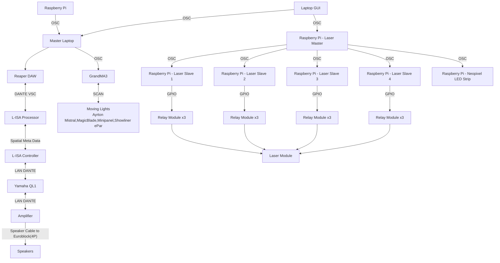

## 
Minimum Viable Product

All the resources required to demostrate a Minimum Viable Product, which basically means a full working demostration of the staion, Art of Hearing

## Overview
> This repository contains all the assests,codes and others for our Station 3 - Art Of Hearing.

>In this Proof Of Concept, there will be a master station which will be shared among all teams, which in the venue, there are 12 speakers in the venue.

>In this station, there will be 3 participants standing at each side of the room, each participants have to listen to the beat that correspond to their side of the room, to get a number and then come together to crack open the combination of the lock.

## Table Of Contents

## References
For the hardware and software connections, please consult the following: 

1. [Backlog 1 Sprint 1](../Backlog%201%20Sprint%201/) - Sending OSC Messages to GrandMA3

2. [Backlog 2 Sprint 1](../Backlog%202%20Sprint%201/) - Reaper and L-ISA Control Using OSC Commands

3. [Backlog 2 Sprint 2](../Backlog%202%20Sprint%201/) - Game

## Hardware and Software Setup

### Hardware Setup
> For the hardware setup, there are no changes made, hence refer to [POC](../POC/README.md) for the set up of hardware.

### System Diagram

>In this system diagram, for any equipments used in the sending of OSC commands <b>MUST</b> be on the same network,including all the IP Addresses of the Raspberry PI.

## Media Assests
> Included in the MVP Demostration are: 
>
>[Legend Board](./Media%20Assests/legendboard.jpg)- Poster with the number Comibinations for the participants to refer to

>[Master File](./Master%20Files/) - Contains all the software used for the MVP, which includes:
> 1. [GrandMA3](./Master%20Files/MasterShowfile_EGL314_MVP_FINAL.show) Master file
> 2. [REAPER](./Master%20Files/314MAINREAPER_POC_FINAL.rpp) Master file
> 3. [L-ISA](./Master%20Files/MAINFILE%20POC_FINAL%20-%20copy.lisa) Master file

## Explanation
> Classified into 2 different folders, for easier differentiation and explantion: 
>1. Code
>2. Laser

### Code
> In the [game.py](./Code/game.py), upon running the program, the start page GUI appears as below: 

>There are mainly 5 buttons for demo, which mainly: 
>1. <b>Start</b> - To start and begin the game
>2. <b>High</b> - Plays a Biwa sound, symbolising the 'H' shown on the Legend Board
>3. <b>Low</b> - Plays a drum, symbolising the 'L' shown on the Legend Board
>4. <b>Demo</b> - Plays a demo number combination, mainly '1','0','1' 
> Participants can play buttons 2-4 as many times as they need to familiarise themselves with the beats and the pace of the demo. When they are ready to begin the game, pressing the 'Start' button starts a timer for 10s which afterwards starts the game.

#### Begin of Game

> When the game begins, this GUI is shown instead: 

>The functions here include 
> 1. <b>Number Combinations</b> - Pressing the '+'or '-' button will increase or decrease the current number shown respectively, able to loop to '9' when pressing '-' when the number is 0.
> 2. <b>Check Combination</b> - When participants has input a number combination, pressing the button wil check if the numbers the particiapants has inputted is the correct combination as what they heard on the speakers, there will 2 scenarios that can happen, mainly:
> 1. <b>Winning Scenario</b> - The combination entered is correct and participatns win the game.
> 2. <b>Losing Scenario</b> - The combination entered is wrong, causing the lights to turn red, while participatns are able to try for a different combination as long as the time does not run out.
>
> When participants run out of time, they are brought back to the start page. This allows for multiple attempts in one smooth gameplay which requires little maintence or rerunning of the program

> The Main Game contains all the functions for sending OSC messages to REAPER and L-ISA.

> [manualcontrol.py](./Code/manualcontrol.py) - allows for manual control of all the functions, audio and lighting wise. 

> The functions include:
> 1. <b>Clear</b>  - Clears any sequences on the GrandMA3  running on the GrandMA3 software
> 2. <b>Lighting</b> - Runs a sequence on the GrandMA3  that directs participants from the previous station to our station. 
> 3. <b>Correct</b> - Runs a sequence on the GrandMA3  for when the correct combination has been entered
> 4. <b>Wrong</b> - Runs a sequence on the GrandMA3  for when the incorrect combination has been entered
> 5. <b>3 Sides</b> - Runs a sequence on the GrandMA3  for the 3 participants to stand in to listen for the sound beats 
> 6. <b>Gather</b> - Runs a sequence on the GrandMA3 which creates a light in the middle of the room for participants to gather 
> 7. <b>Combi 1-5</b> - Plays the commbination number beats
> 8. <b>Play</b> - Plays the timeline on Reaper
> 9. <b>Pause</b> - Pauses the timeline on Reaper

>[ma3control.py](./Code/ma3control.py)- contains all the functions to send OSC mesages to GrandMA3 

## Laser
