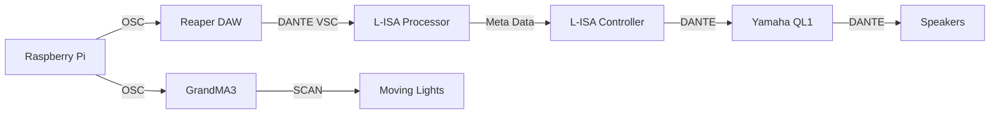

## 
Proof Of Concept

All the resources required to demostrate a full proof of concept!!

## Table Of Contents
>- [Overview](#overview) 

>- [System Diagram](#system-diagram)
>    - [Hardware and Software Setup](#hardware-and-software-setup)
>   - [Touchscreen Setup](#touchscreen-display-setup)
>- [Media Assests](#media-assests)
>- [Codes](#codes)
>- [Breakdown](#file-breakdown)

## Overview
> In this Proof Of Concept, there will be a master station which will be shared among all teams, which 

## Hardware and Software Setup

### System Diagram

### Touchscreen Display Setup

> 1. On the Raspberry Pi 3 7" Touchscreen Display, gently remove the black tabs of the ribbon cable connector simultaneously

> 2. Insert the ribbon cable into the connector with the blue side down. 
>Push the connector's black tabs back in to secure it.

>3.  Connect the wires as such:
> * Red jumper wire to 5V on the display board
> * Green jumper wire to SDA on the display board
> * Yellow jumper wire to SCL on the display board
> * Black jumper wire to GND on the display board

> 4. On the Raspberry Pi, Connect the following:
> * Red jumper wire to 5V (either pin 2 or pin 4) on the Raspberry Pi
> * Green jumper wire to GPIO 2 (Pin 3) on the Raspberry Pi
> * Yellow jumper wire to GPIO 3 (Pin 5) on the Raspberry Pi
> * Black jumper wire to Ground (any ground pin) on the Raspberry Pi 

> 5. Boot up your Raspberry Pi and the display touchscreen should work!

## Media Assests

> All the media assests utilised in this POC include:
>
> [Legend Board](./Media%20Assests/Legend%20Board.png) - Poster with the coded messages to decipher

> [Audio Files](./Audio%20Files/AudioFiles.zip) - zip file with all the audio files used in this POC demostration

> [Reaper]() - Master Reaper file used

>[GrandMA3]() - Master MA3 file used with the correct patching of lights

## Codes
> In **[this folder](./Codes)** , there are mainly 3 python files, all of which are needed to run and showcase the demostration smoothly.

> 1. [numblock_gui.py](./Codes/numblock_gui.py) - main file and GUI that trigger the functions to be called from the other files.
> 2. [dawcontrol.py](./Codes/dawcontrol.py) - python file to jump to various markers and allow of play/pause of track.
> 3. [ma3control.py](./Codes/ma3control.py) - python file to trigger sequences in GrandMA3 software and also clear them afterwards. 

## File Breakdown
> 1. [numblock_gui.py](./Codes/numblock_gui.py)
>

<b>Specifics</b>

 When initially running [numblock_gui.py](./Codes/numblock_gui.py), the start screen appears. There are 4 buttons, "High", which is able to play the "H" beat once, "Low", which is able to play the "L" beat once, and "Wind", which will play the wind sound to signify the ending of a coded number. All of the purpose is to allow users to familiarise themselves with the different beats before pressing the "Start" button which will initiate a countdown sequence of 3 seconds before starting the game.

 When the page flips to the number combination, it will start a  countdown of 60 seconds which then have 3 number labels with **"+"** and **'-'** buttons beside them. pressing the **'+**' will increase the current value of the label by 1 while pressing the **'-**' will do the opposite.

 However, when pressing the **'+'** or **'-'** when the value is either 0 or 9, it will loop back to 9 or 0, respectively.

 There is also a button **"Check Combination"** which will check the current number combination and verify if it is the correct combination from a set of list. If it is, the game ends and the GUI goes back to the start page. If not, the timer continues until the time is up, which will then also bring the GUI back to the start page. This  [numblock_gui.py](./Codes/numblock_gui.py) allows for multiple plays which requires minimal maintenance and troubleshooting.</deatils>

