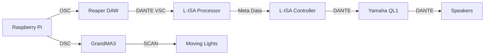

## 
Proof Of Concept

All the resources required to demostrate a full proof of concept!!

## Table Of Contents
>- [Overview](#overview) 

>- [System Diagram](#system-diagram)
>    - [Hardware and Software Setup](#hardware-and-software-setup)
>   - [Touchscreen Setup](#touchscreen-display-setup)

## Overview
> In this Proof Of Concept, there will be a master station which will be shared among all teams 

## Hardware and Software Setup

### System Diagram

### Touchscreen Display Setup

> 1. On the Raspberry Pi 3 7" Touchscreen Display, gently remove the black tabs of the ribbon cable connector simultaneously

> 2. Insert the ribbon cable into the connector with the blue side down. 
>Push the connector's black tabs back in to secure it.

>3.  Connect the wires as such:
> * Red jumper wire to 5V on the display board
> * Green jumper wire to SDA on the display board
> * Yellow jumper wire to SCL on the display board
> * Black jumper wire to GND on the display board

> 4. On the Raspberry Pi, Connect the following:
> * Red jumper wire to 5V (either pin 2 or pin 4) on the Raspberry Pi
> * Green jumper wire to GPIO 2 (Pin 3) on the Raspberry Pi
> * Yellow jumper wire to GPIO 3 (Pin 5) on the Raspberry Pi
> * Black jumper wire to Ground (any ground pin) on the Raspberry Pi 

> 5. Boot up your Raspberry Pi and the display touchscreen should work!