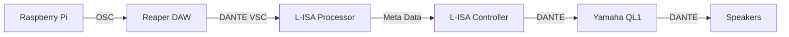

## 
Proof Of Concept

All the resources required to demostrate a full proof of concept!!

## Table Of Contents
>- [Overview](#overview) 

>- [System Diagram](#system-diagram)
    - [Hardware and Software Setup](#hardware-and-software-setup)
    - [Touchscreen Setup](#touchscreen-display-setup)

## Overview

## Hardware and Software Setup

### System Diagram

### Touchscreen Display Setup

