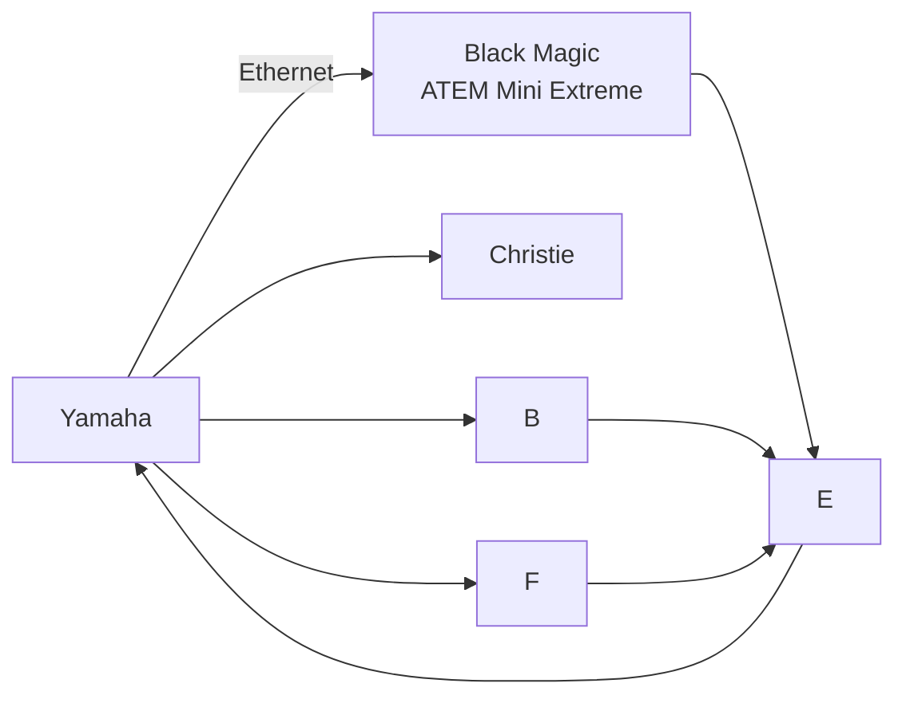

# Header 1 
## Header 2
### Header 3
#### Header 4
##### Header 5
###### Header 6

**bold**

*italic*

~~strikethrough~~

***bold & Italic***

*~~italic & Strikethrough~~*


# List of Singaporean Food

* Chicken Rice

* Bak Kut Teh
    * Herbal Kind
    * Pepper Kind
        * sd
            * asfs

+ Nasi Padang
- Maggie Goreng

1. Black Pepper Crab
2. White Pepper Crab
3. .... Pepper Crab


# Image of a Cat
This is a test picture, thanks! 

To read more please visit [here](https://www.nyp.edu.sg/)


# To install OSC in Raspberry Pi

1. Please install python-osc in raspberry pi: `pip install python-osc`


## To create GUI for OSC Control
Please refer to the sample code below

```
import tkinter as tk

main = tk.TK()

main.mainloop()
```

# To quote Sun Tzu

> Every poo poo is a pee pee, but not every pee pee is a poo poo

[*Sun Tzu*](websitelink)

|Header 1 | Header 2 | Header 3 |
| ------- | -------- | -------- |
| Data 1 | Data 2 | Data 3|
|Data 1|Data 2| Data 3|

# Nanyang Polytechnic

## School of Applied Science

### Diploma in Applied Chemistry 
---

#### Media and System Specilization
---

## Flowchart 




### Sequence Diagram
```mermaid
sequenceDiagram;

Dick ->> Quan Feng: How are you?
Quan Feng -->> Dick: Sky is Blue
